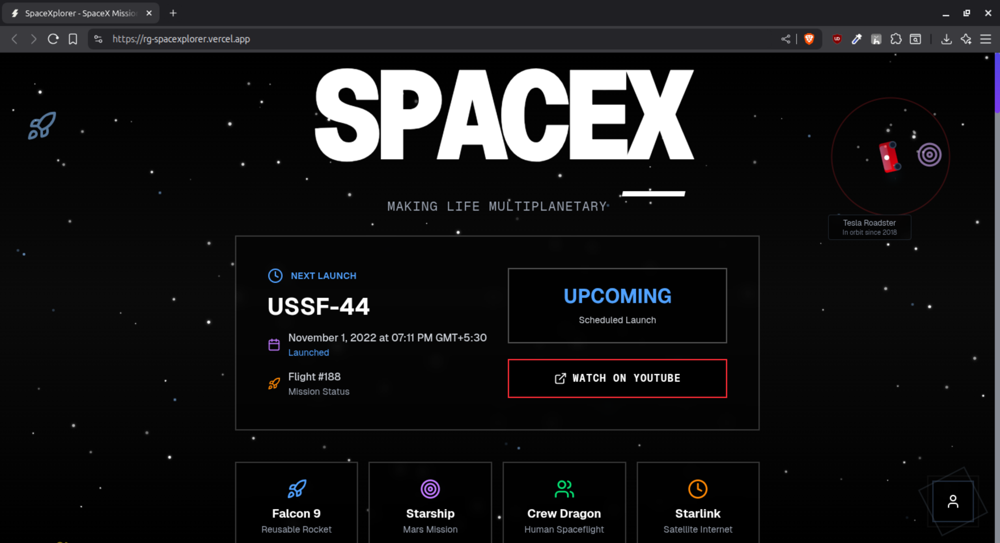
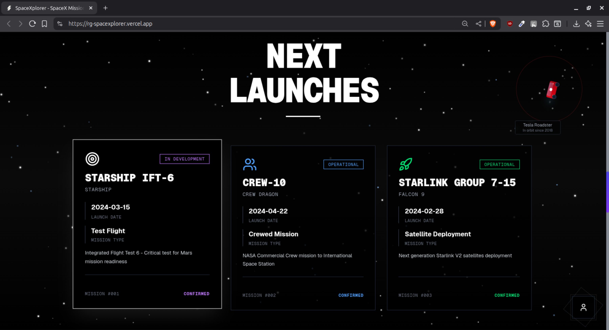

# SpaceXplorer

A minimal, interactive space exploration app. Discover SpaceX missions and space vehicles with real-time data.

**Live Demo**: [https://spacexplorer.vercel.app/](https://spacexplorer.vercel.app/)




## Features

- Real-time SpaceX mission data
- Launch tracking and vehicle information
- Interactive space visualizations
- Dark-mode UI
- No login required
- Free API (no keys needed)

## Setup

1. Install and run:

```bash
npm install
npm run dev
```

Visit [http://localhost:3000](http://localhost:3000)

## Deploy

Deploy on [Vercel](https://vercel.com/) with one click.

## License

MIT
